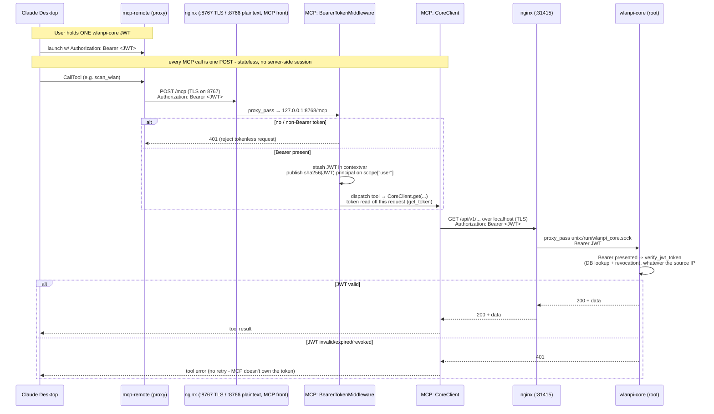
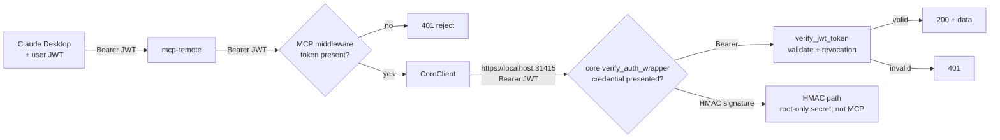

# Authentication flow: Claude → MCP → nginx → wlanpi-core

wlanpi-mcp implements **no authentication of its own**. The user holds a single
wlanpi-core JWT, and that same token is forwarded on every outbound wlanpi-core API call,
where core validates it. This document traces the token end to end, including the nginx
`X-Real-IP` override that lets on-box (loopback) calls reach core's JWT validator instead
of its localhost HMAC path.

The MCP endpoint (`/mcp`, streamable HTTP, stateless) is fronted by an MCP-owned
nginx site: the uvicorn daemon binds loopback-only (127.0.0.1:8768) and nginx
exposes two listeners. `8767`
terminates the device's self-signed TLS and is the preferred endpoint; `8766`
is a plaintext fallback for harnesses that cannot validate the self-signed
cert (e.g. goose), where the JWT crosses the LAN in cleartext. Use 8767
whenever the harness can be pointed at the cert.

## Sequence

## Where each auth decision happens

## The key handoffs, in words

| Hop | Carries | Auth decision |
|---|---|---|
| Claude Desktop → mcp-remote | `Authorization: Bearer <JWT>` | none - just transport |
| mcp-remote → MCP nginx front (`:8767` TLS) | the same Bearer on every `/mcp` POST | **nginx:** TLS termination with the self-signed cert; the JWT is encrypted in transit. (`:8766` is the plaintext fallback - same Bearer, but cleartext, for harnesses that cannot validate the cert) |
| MCP nginx front → MCP middleware | same Bearer, forwarded to `127.0.0.1:8768` | **MCP:** reject if no Bearer (401); else stash JWT in contextvar |
| MCP CoreClient → core nginx (`:31415` TLS) | `Bearer <JWT>`, verified against the device cert (`WLANPI_CORE_CA`) | none yet - MCP never validates |
| core nginx → core (unix socket) | same Bearer | none - transport only |
| core `verify_auth_wrapper` | Bearer presented | **core:** dispatches on the credential → validates token, checks revocation |

The single source of truth for "is this caller allowed" stays in core's `verify_jwt_token` -
MCP and nginx only route; neither mints nor validates tokens. The one JWT the user holds
is the same credential end to end.

## No routing hint: core dispatches on the credential

Core used to pick HMAC or JWT from the source address, which forced loopback callers onto
the HMAC path. MCP worked around that with an `X-Wlanpi-Client: mcp` header that core's
nginx turned into a non-loopback `X-Real-IP`. Core now selects the scheme from the
credential presented (wlanpi-core #159/#160): a Bearer token takes the JWT path from any
source. The sentinel is gone from core's nginx, and CoreClient no longer sends the header
(`tests/test_client.py` asserts its absence).

## One token per request: the stateless transport

The daemon serves streamable HTTP in stateless mode (`stateless_http=True` in
`create_server`). There is no server-side MCP session: every `POST /mcp` is a complete
exchange, handled by a server instance created for that request and torn down after it.
Two consequences:

- **The token that reaches wlanpi-core is the Bearer on that very request.** The transport
  binds the Starlette request to the MCP call, and `get_token()`
  (`wlanpi_mcp/auth/token_context.py`) reads the `Authorization` header off it, falling
  back to the contextvar the middleware set. Tool calls run in a task the SDK's session
  manager spawns, so reading the request itself rather than relying on contextvar
  inheritance is what makes this robust.
- **There is no session for another caller to inject into.** Under the legacy SSE
  transport a session spanned a long-lived `GET /sse` plus per-call `POST /messages/`
  requests routed by `session_id`, and the server had to bind each session to the token
  that opened it. With nothing shared between requests, that attack surface is gone.

`BearerTokenMiddleware` still publishes a principal on `scope["user"]` keyed by
`sha256(token)`. The SDK's streamable HTTP session manager binds sessions to that
principal and refuses a mismatched request with the same `404` as a nonexistent session,
so the per-token binding is in place should stateful mode ever be enabled. The token is
not parsed or validated here (that stays wlanpi-core's job); the fingerprint only needs to
be stable and unique per token, so a raw SHA-256 suffices and keeps the token itself off
the principal object.

Why stateless: the legacy SSE transport stranded Claude Code after any reconnect (daemon
restart, idle gap). The client re-opened the stream without re-sending `initialize`, and
the server answered every later tool call with `-32602 Invalid request parameters`
(python-sdk issue #2579, closed as not planned). A stateless server has no handshake
state to lose. Transport
encryption is a separate control and is provided by the MCP nginx front:
nginx terminates TLS on 8767 (self-signed cert) in front of the loopback-only
daemon, so the token never crosses the wire in cleartext on the preferred
endpoint. The 8766 plaintext fallback (for harnesses that cannot validate the
cert) sends the token in cleartext - use it only on a trusted network.

## Stdio mode

There are no HTTP headers in stdio transport, so the middleware/contextvar path does not
apply. `WLANPI_CORE_TOKEN` is the fallback token source, read from the process
environment only: a value in `/etc/wlanpi-mcp/config.env` is ignored with a warning, so a
token is never persisted in a config file. Inject it at launch from a keychain or a 0600
env file.
